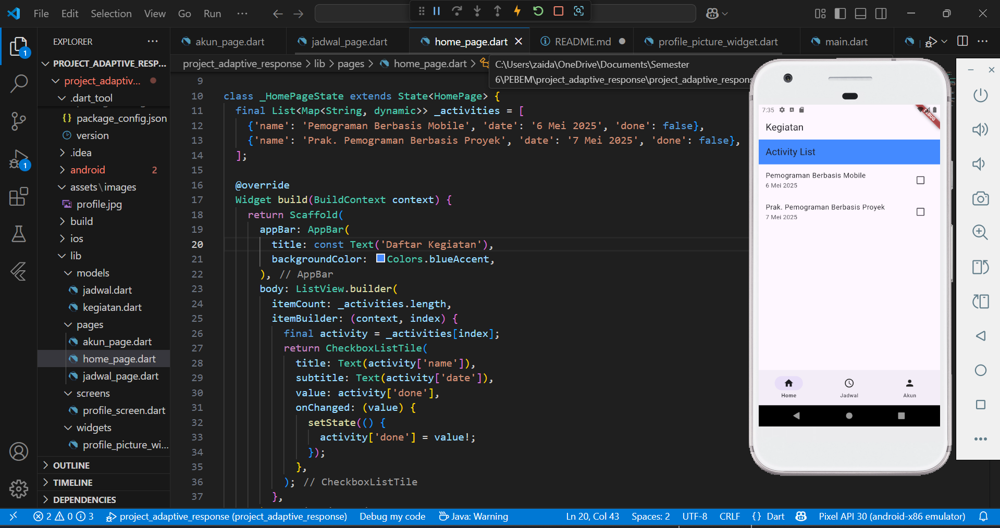
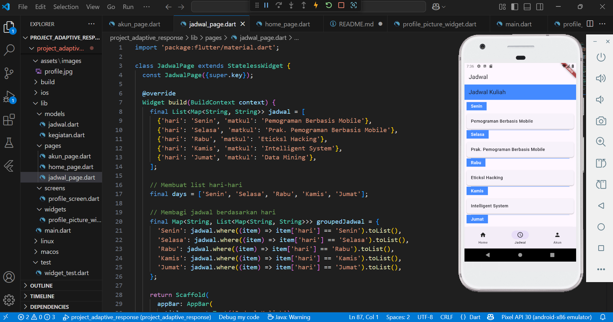
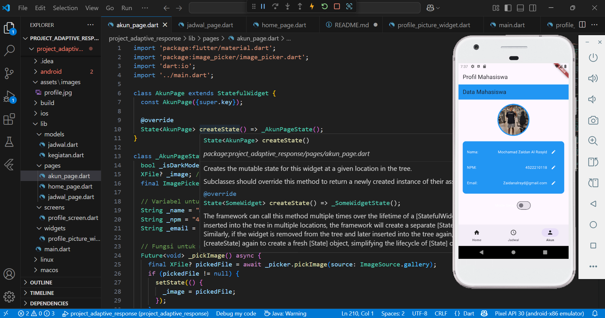

# UTS Project Adaptive response

## Nama : Mochamad Zaidan Al Rasyid NPM : 4522210118

## Aplikasi ini adalah aplikasi mobile untuk mahasiswa yang memiliki tiga halaman utama: Home, Jadwal Kuliah, dan Akun Profil. Aplikasi ini mengadaptasi tampilan sesuai dengan ukuran layar perangkat menggunakan flutter_adaptive_scaffold dan memiliki kemampuan untuk mengganti tema antara light dan dark.

## Fitur Utama 🌟
### Home 🏠: Menampilkan daftar kegiatan mahasiswa dengan ListView. Setiap kegiatan memiliki nama, tanggal, dan checkbox untuk menandai apakah kegiatan sudah selesai.

## Jadwal Kuliah 📅
### Menampilkan jadwal kuliah mahasiswa dalam bentuk Card atau Table untuk memudahkan pengelolaan waktu kuliah.

## Akun Profil 👤
### Menampilkan data pengguna seperti nama, NIM, dan email. Pengguna dapat mengganti tema antara light dan dark menggunakan tombol switch.

## Penjelasan Halaman 📝
## 1. Home 🏠
### Halaman Home menampilkan daftar kegiatan mahasiswa menggunakan ListView. Setiap kegiatan memiliki informasi nama kegiatan dan tanggal. Terdapat checkbox untuk menandai kegiatan yang sudah selesai.

## 2. Jadwal Kuliah 📅
### Halaman ini menampilkan jadwal kuliah selama seminggu dalam bentuk Card atau Table. Pengguna dapat melihat jadwal harian secara rinci.

## 3. Akun Profil 👤
### Halaman ini menampilkan data pengguna seperti Nama, NIM, dan Email.Pengguna dapat mengganti mode tema (light/dark) melalui switch yang ada.

## Fitur Unik 📸
### Pengguna dapat mengganti gambar profil mereka menggunakan perangkat yang digunakan (misalnya memilih gambar dari galeri atau mengambil foto menggunakan kamera).

## Penggunaan 📲
### Home 🏠: Menampilkan daftar kegiatan mahasiswa dan memberikan pilihan untuk menandai kegiatan yang sudah selesai.
### Jadwal Kuliah 📅: Menampilkan jadwal kuliah setiap harinya dalam bentuk Card atau Table.
### Akun Profil 👤: Menampilkan data pengguna dan memungkinkan pengaturan tema aplikasi (light/dark). Pengguna juga dapat mengganti gambar profil menggunakan perangkat mereka.
